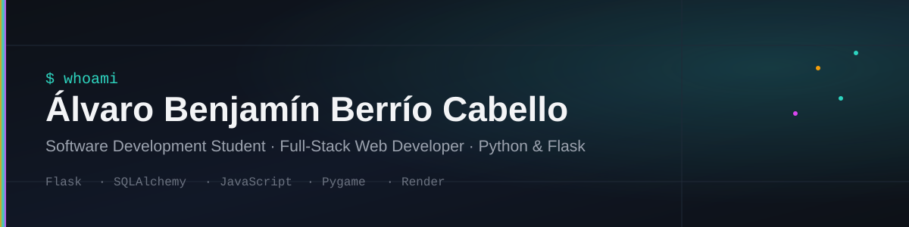

# Hi 👋 I'm Álvaro Benjamín Berrío Cabello

### Software Developer · Systems Engineering Student · Full-Stack Builder

I design and build web applications, educational platforms, interactive experiences,
developer tools and AI-assisted software systems.

My current focus is turning independent projects into a **coherent software ecosystem**
with reusable architecture, automation, security, documentation and continuous development.

---

## 🚀 What I'm Building

I'm developing a growing ecosystem around four main areas:

- 🌐 **Web Applications**
- 🤖 **AI & Developer Tools**
- 🎓 **Educational Technology**
- 🎮 **Interactive & Cultural Experiences**

My projects are not isolated experiments.

They are becoming part of a structured development ecosystem focused on:

**Architecture → Development → Quality → Security → Automation → Deployment**

---

# 🧠 Berrío AI Platform

> **My development control plane for managing and evolving my software ecosystem.**

The **Berrío AI Platform** is being designed as the central engineering layer
connecting architecture, documentation, AI agents, project governance,
security policies and future automation.

### Current capabilities

- 🧠 AI-assisted development architecture
- 🤖 Specialized development agents
- 🔐 Security and credential policies
- 📋 Project registry
- 🏗️ Architecture documentation
- ✅ Quality policies
- 📚 Engineering documentation
- 🔄 Multi-project development governance

### Architecture

```text
                    BERRÍO AI PLATFORM
                           │
             ┌─────────────┴─────────────┐
             │                           │
       Control Plane               Project Ecosystem
             │                           │
      ┌──────┼──────┐          ┌─────────┼─────────┐
      │      │      │          │         │         │
   Agents  Rules  Docs      Web Apps   Games    Tools
      │      │      │          │         │         │
      └──────┴──────┴──────────┴─────────┴─────────┘
                           │
                     GitHub Ecosystem
